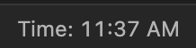
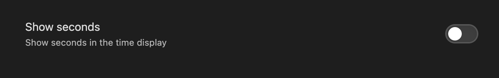

# Status Bar Clock for Obsidian

This plugin simply adds a status bar clock to Obsidian.  I find myself working in full screen mode quite a bit and could not see the time, so I created this plugin.

## Options

One option (for now) - toggle showing the seconds in the clock.  With this turned off, the clock will show the hour: minutes AM/PM.  With this turned on this the clock will update every second and show hour : minutes : seconds AM/PM.

## How to Install

### From Obsidian

1. Open Settings > Community Plugins
1. Community Plugins > Click Browse
1. Search Status Bar Clock
1. Click install
1. Close community plugin browser and activate the plugin

### From Git

1. Close obsidian
2. Go to your vault .obsidian/plugins folder in the terminal
3. git clone https://github.com/marty331/status-bar-clock-obsidian.git
4. Open obsidian
5. Go to settings -> community plugins
6. Scroll down, find "Status Bar Clock" plugin and enable it

## Pricing
The plugin is free, athough if you wanna say thanks, feel free to buy me a coffee

## Notes 
If there're any bugs or instabilities, don't hesitate to open an issue 